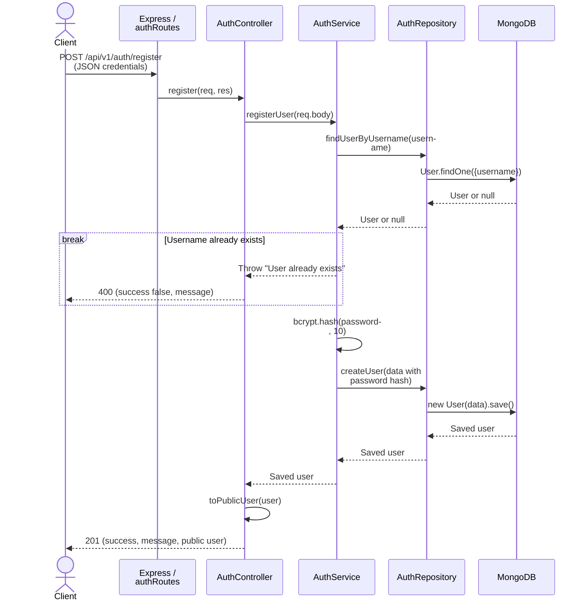
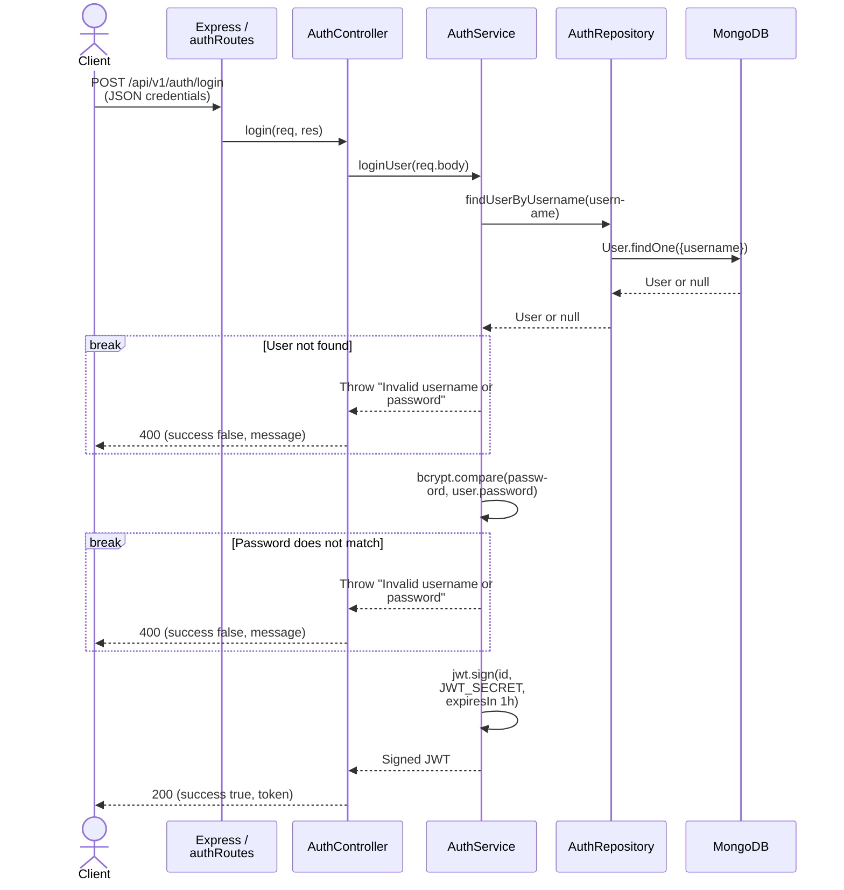
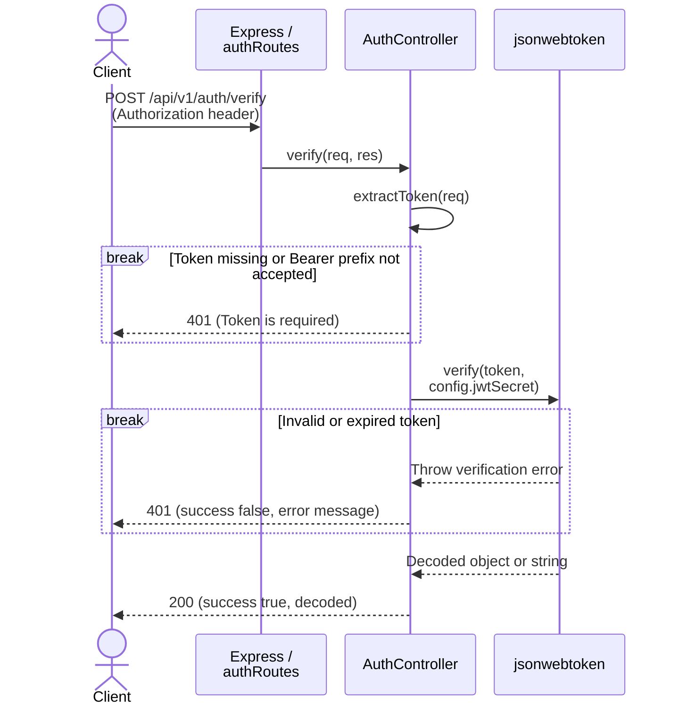

# Authentication Flows

AuthMS implements registration, login, and bearer-token verification. This page traces the current code through those requests. See the [architecture overview](overview.md) for service boundaries, the [API guide](../api/reference.md) for usage, and the [interactive API reference](../api/swagger.md) for the contract maintained in [OpenAPI](../api/openapi.yaml).

## Layer Responsibilities

| Layer                       | Source                                                                                                                                                                      | Current responsibility                                                                                                                                 |
| --------------------------- | --------------------------------------------------------------------------------------------------------------------------------------------------------------------------- | ------------------------------------------------------------------------------------------------------------------------------------------------------ |
| Bootstrap and configuration | [server.ts](https://github.com/amin-newcastle/authMS/blob/main/src/server.ts), [config](https://github.com/amin-newcastle/authMS/tree/main/src/config)                      | Load environment configuration, initiate the MongoDB connection, and start the HTTP listener outside tests.                                            |
| Express app and routes      | [app.ts](https://github.com/amin-newcastle/authMS/blob/main/src/app.ts), [auth.routes.ts](https://github.com/amin-newcastle/authMS/blob/main/src/api/routes/auth.routes.ts) | Parse JSON, mount `/api/v1/auth`, dispatch the three POST routes, and handle errors passed to Express.                                                 |
| Controller                  | [auth.controller.ts](https://github.com/amin-newcastle/authMS/blob/main/src/api/controllers/auth.controller.ts)                                                             | Read requests, call registration/login services, project public user fields, and write HTTP responses. Extract and verify JWTs directly for `/verify`. |
| Service                     | [auth.service.ts](https://github.com/amin-newcastle/authMS/blob/main/src/api/services/auth.service.ts)                                                                      | Check duplicate usernames, hash and compare passwords with bcrypt, and sign login JWTs.                                                                |
| Repository                  | [auth.repository.ts](https://github.com/amin-newcastle/authMS/blob/main/src/api/repositories/auth.repository.ts)                                                            | Find users by username and create users through the Mongoose `User` model. It does not hash passwords.                                                 |
| Models / Mongoose           | [user.model.ts](https://github.com/amin-newcastle/authMS/blob/main/src/api/models/user.model.ts)                                                                            | Validate required string fields `username` and `password`, map `User` queries and documents to MongoDB, and declare the unique username index.         |
| MongoDB                     | [Database collections](../database/collections.md)                                                                                                                          | Persist user records and enforce the unique username index. Password hashing remains in `AuthService`.                                                 |

Registration and login traverse the service and repository layers. Verification calls `jsonwebtoken` in `AuthController` and makes no database query. In the diagrams, database arrows represent repository operations through the Mongoose `User` model. A `break` block ends the request when its error condition applies; otherwise processing continues below it.

## Registration

`POST /api/v1/auth/register` accepts JSON credentials. `AuthController.register` passes `req.body` to `AuthService.registerUser`, which looks up the username before hashing anything. An existing user causes `User already exists` and a `400` response.

For a new username, the service calls `bcrypt.hash(password, 10)`: the configured bcrypt cost is **10**. It replaces the input password with that hash before calling `AuthRepository.createUser`. The repository constructs and saves a `User`; the model's required fields and MongoDB unique index also apply at persistence time.

The controller returns `201` with `success: true`, the registration message, and `user`. Its `toPublicUser` projection includes only `_id` converted to a string and `username`. The stored password hash is excluded, and registration does not issue a token.



Hashing, validation, and database failures caught by the registration controller also become `400` responses. A duplicate insert rejected by the unique index can therefore have a database error message instead of the service's `User already exists` message.

## Login

`POST /api/v1/auth/login` passes JSON credentials to `AuthService.loginUser`. The service loads the user by username and compares the supplied password against the stored hash with `bcrypt.compare`. A missing user and a failed comparison both produce `Invalid username or password`; the controller responds with `400`.

When the comparison succeeds, the service calls `jwt.sign({ id: user._id }, config.jwtSecret, { expiresIn: '1h' })`. The resulting JWT contains the user ID and the library-generated `iat` and `exp` claims, with a one-hour lifetime. `AuthController.login` returns `200` with `success: true` and `token`. It does not return the stored user document or create a database session record.



Other failures in the login path, including database, bcrypt, or signing errors, also become `400` responses. Only the missing-user and password-mismatch cases deliberately share the generic credential message.

## Token Verification

`POST /api/v1/auth/verify` reads `Authorization: Bearer <token>` and requires no request body. The controller uses the case-sensitive check `authHeader.startsWith('Bearer ')`, then `authHeader.slice(7)`. It does not trim the remaining token. An absent header, a different prefix, or an empty token produces `401` with `Token is required`. A token supplied only in the request body is ignored.

`AuthController.verify` calls `jwt.verify(token, config.jwtSecret)` directly. The library checks the signature and applicable time claims; invalid or expired tokens throw, and the controller returns `401` with the error message. There are no service or repository calls in this path.

On success, the controller returns `200` with `success: true` and the raw verification result in `decoded`, which can be an object or a string. Although AuthMS login tokens contain `id`, `iat`, and `exp`, this endpoint does not require those fields or validate a separate payload schema. It supplies no issuer or audience restrictions and does not look up whether the user still exists, check roles, or consult a revocation list.



## Validation and Error Boundaries

The [OpenAPI credentials schema](../api/openapi.yaml) declares `username` and `password` as required strings. Express parses JSON, but the application does not validate incoming requests against that schema. Controllers forward the body to the service; Mongoose validates the saved document, and bcrypt or database operations may reject invalid inputs. These checks do not provide complete validation of incoming credentials, password-strength rules, or explicit username normalization.

The diagrams start with requests that reach their controller. Malformed JSON with `Content-Type: application/json` fails earlier in `express.json()`. The global handler in `app.ts` responds with `500` and a message-only object, without a `success` field. This applies to all three POST routes, even verification if a malformed JSON body is sent.

| Error boundary                                                       | HTTP status | Response fields             |
| -------------------------------------------------------------------- | ----------- | --------------------------- |
| Registration or login controller catches a failure                   | `400`       | `success: false`, `message` |
| Verification controller rejects a missing token or catches a failure | `401`       | `success: false`, `message` |
| Express global error handler, including JSON parser failures         | `500`       | `message` only              |

Controllers pass through `Error.message`; a thrown value that is not an `Error` becomes `An unknown error occurred`. The global handler uses the error message or `Internal Server Error`. Error messages from dependencies are currently exposed by these handlers.

## Trust Boundaries

External clients cross the HTTP boundary to reach AuthMS. Registration and login then cross a separate database connection boundary to access MongoDB; token verification stays within AuthMS.

```text
External client -> HTTP boundary -> AuthMS -> Database boundary -> MongoDB
```

| Boundary                                  | Current handling and implications                                                                                                                                                                                                                              |
| ----------------------------------------- | -------------------------------------------------------------------------------------------------------------------------------------------------------------------------------------------------------------------------------------------------------------- |
| Client password to AuthMS                 | Registration and login receive the raw password. Hashing occurs in `AuthService` before registration persistence; login compares against the hash. Passwords and hashes must stay out of logs and public responses.                                            |
| Runtime configuration to token operations | `JWT_SECRET` is loaded by configuration and used for both signing and verification. It must stay private: possession permits token creation. Configuration falls back to an empty string and does not enforce a valid secret at startup.                       |
| JWT to the caller and back                | Login returns the JWT to the caller, which later supplies it as a bearer token. Verification returns the decoded payload without extra claims validation or an account lookup. Applications consuming that result must make their own authorization decisions. |
| AuthMS to MongoDB                         | The repository persists credentials through the `User` model and retrieves password hashes for login. The controller limits registration responses to public fields. Database access and connection protection remain deployment responsibilities.             |

See the [security design](../security/overview.md) for secret handling and production hardening. The [testing strategy](../development/testing.md) describes controller and service unit tests and repository integration tests; those suites cover public user responses, duplicate users, credential failures, and bearer-header extraction, among other behaviors.
