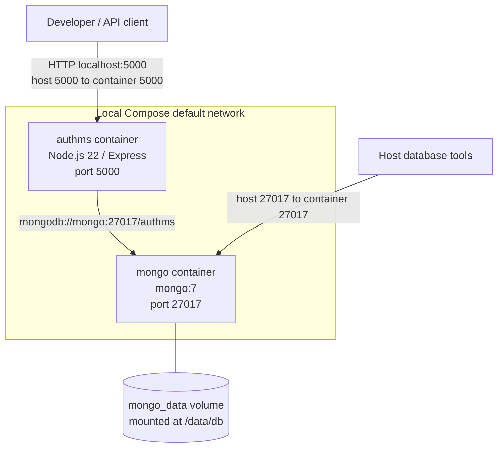
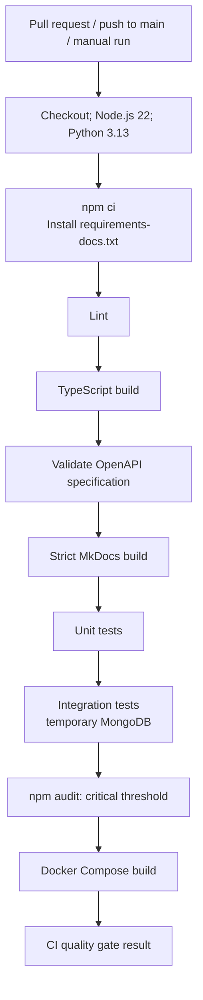
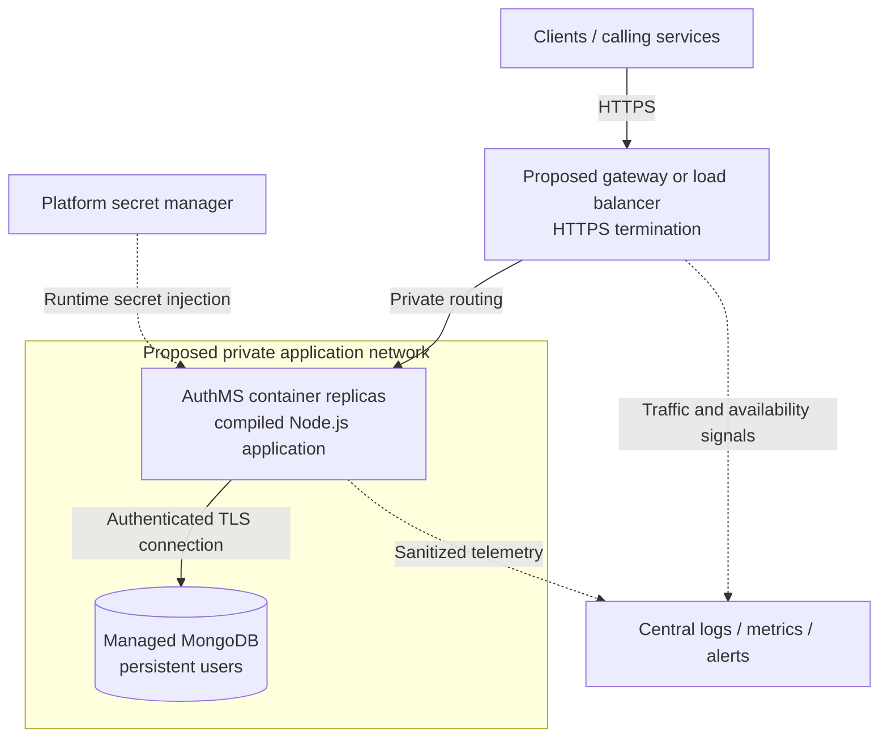

# Deployment Architecture

AuthMS currently supports a Node.js development process, a local Docker Compose stack, and GitHub Actions validation. A separate workflow publishes the documentation to GitHub Pages. The repository does not define a production application deployment; the production design below is a proposal.

This page explains runtime boundaries and operational behaviour. Use the [Docker guide](../development/docker.md) for commands, the [architecture overview](overview.md) for application layers, and [authentication flows](authentication-flows.md) for request processing.

## Local Node.js Development

`npm run dev` sets `NODE_ENV=development` and runs `src/server.ts` through Node.js with the `ts-node/esm` loader. Nodemon watches `src` and restarts the process when source files change. Environment files are outside that watch path, so configuration changes require a restart.

Local development, Docker, and CI use Node.js 22. Developers must install or switch to Node.js 22.x before running local commands; `.nvmrc` and `.node-version` specify major version `22`, and `package.json` declares `engines.node: "22.x"`. CI reads `.nvmrc`, while both Docker stages use `node:22-alpine`.

The developer supplies MongoDB through `DB_URI`: it can address a local MongoDB instance or an external development database such as MongoDB Atlas. Starting AuthMS does not provision either database. With the README's example `PORT=5000`, clients use `http://localhost:5000`; without a configured port, the application defaults to `3000`.

For a compiled local process, `npm run build` produces `dist/` and `npm start` sets `NODE_ENV=production` before running `dist/server.js`. This changes runtime behaviour and environment-file selection; it does not deploy the application to a production host.

## Runtime Configuration

`src/config/env.ts` selects `.env.<NODE_ENV>` relative to the working directory, defaulting to `.env.development` if `NODE_ENV` is absent. Existing process environment values take precedence over values loaded by dotenv. Configuration is read once at module initialization.

| Variable     | Application fallback | Local Node development                                               | Local Docker Compose                                                | CI quality gate                                                                                              | Proposed production                                                   |
| ------------ | -------------------- | -------------------------------------------------------------------- | ------------------------------------------------------------------- | ------------------------------------------------------------------------------------------------------------ | --------------------------------------------------------------------- |
| `NODE_ENV`   | `development`        | `development`, set by `npm run dev`                                  | `production`, set by Compose                                        | `test`, set by workflow                                                                                      | `production`                                                          |
| `PORT`       | `3000`               | `5000` in the README example; otherwise configured value or fallback | `5000`                                                              | Not set by workflow; tests do not require a running API listener                                             | Explicit platform configuration                                       |
| `DB_URI`     | Empty string         | Developer-supplied local or external development database URI        | `mongodb://mongo:27017/authms`                                      | `mongodb://127.0.0.1:27017/authms_test` placeholder; integration setup connects to its own temporary MongoDB | Authenticated managed MongoDB connection supplied securely at runtime |
| `JWT_SECRET` | Empty string         | Developer-supplied development secret                                | `${JWT_SECRET}` resolved by Compose and injected into the container | Test-only placeholder from workflow                                                                          | Environment-specific secret injected by deployment platform           |

The application does not validate all required configuration at startup. An empty `DB_URI` skips the database connection, including in production mode. An empty `JWT_SECRET` is accepted by the configuration loader and fails later when used for signing or verification.

Compose interpolation happens before the container starts. The host shell supplies `JWT_SECRET` in the documented workflow; Compose also supports interpolation from an environment file. This is separate from the application's `.env.<NODE_ENV>` loader. `.dockerignore` excludes real `.env` files, and the final image receives configuration through its process environment. See [Docker's interpolation rules](https://docs.docker.com/compose/how-tos/environment-variables/variable-interpolation/) and the [security overview](../security/overview.md) for secret handling.

## Local Docker Deployment

The Compose stack runs the compiled production image against a local development database. `NODE_ENV=production` does not provide production infrastructure, authentication for MongoDB, HTTPS, or automatic scaling.

Both services join the implicit Compose default network. Inside `authms`, the name `mongo` resolves to the database service; `localhost` would refer to the AuthMS container itself. The published host ports support access from the developer's machine, while service-to-service traffic uses the container port. See [Docker's default network behaviour](https://docs.docker.com/compose/how-tos/networking/).

| Component     | Current configuration                                                                                      |
| ------------- | ---------------------------------------------------------------------------------------------------------- |
| AuthMS image  | Built from the repository Dockerfile                                                                       |
| Builder stage | `node:22-alpine`; `npm ci`; `npm run build` compiles TypeScript into `dist/`                               |
| Runtime stage | `node:22-alpine`; `npm ci --omit=dev --ignore-scripts`; copies compiled `dist/` from the builder           |
| Startup       | `CMD ["node", "dist/server.js"]` runs compiled JavaScript directly; Compose supplies `NODE_ENV=production` |
| Port          | Dockerfile declares `EXPOSE 5000`; Compose publishes `5000:5000`                                           |
| Runtime user  | No `USER` instruction selects a non-root account                                                           |
| MongoDB       | `mongo:7`, published as `27017:27017`; no database authentication or TLS configured in Compose             |
| Persistence   | Named volume `mongo_data` mounted at `/data/db`; no application data volume                                |

The named MongoDB volume preserves users across container recreation and ordinary `docker compose down`. Removing the volume, including with `docker compose down -v`, deletes that local database storage.

`depends_on: [mongo]` orders container startup. It does **not** wait until MongoDB can accept connections. Neither service has a Compose health check, and the Dockerfile defines no `HEALTHCHECK`. The comment suggesting `depends_on` ensures database readiness is stronger than the configuration actually guarantees. See [Docker's startup-order documentation](https://docs.docker.com/compose/how-tos/startup-order/).

## CI Validation Environment

`.github/workflows/ci.yml` runs on pull requests targeting `main`, pushes to `main`, and manual dispatch. Its single `CI quality gate` job uses `ubuntu-latest`, Node.js 22, Python 3.13, and a 20-minute timeout. Newer runs cancel older runs for the same branch or pull request.

After `npm ci` and `python -m pip install -r requirements-docs.txt`, the checks run sequentially in the order shown above. See the [CI quality gate](../development/ci.md#quality-gate) for the exact commands.

A failed check fails the job; subsequent ordinary steps do not run. The audit threshold blocks critical vulnerabilities, while lower-severity findings require separate review. Repository branch protection or rulesets determine whether this CI result is required before merging.

The integration setup creates a temporary MongoDB process with `mongodb-memory-server` and connects Mongoose to its generated URI. It disconnects and stops that process after the suite; repository tests clear users before each test. This tests persistence without using the Compose database or the workflow's placeholder database URI. A MongoDB binary download may be needed when it is not cached. The current integration suite exercises the repository and test helpers, rather than starting the full Compose application stack.

The final Docker step builds the image only. It does not start containers, probe the application, publish an image, or deploy AuthMS. See [continuous integration](../development/ci.md) and [testing strategy](../development/testing.md) for maintenance details.

## Documentation Publishing

`.github/workflows/documentation.yml` is a separate workflow. It runs manually or on pushes to `main` changing `docs/**`, `mkdocs.yml`, `requirements-docs.txt`, or that workflow file.

The build job installs the documentation requirements with Python 3.13, configures Pages, runs `mkdocs build --strict`, and uploads `site/` with `actions/upload-pages-artifact`. The deployment job depends on that build and uses `actions/deploy-pages` with the `github-pages` environment and job-scoped `pages: write` and `id-token: write` permissions. It has no dependency on completion of the separate CI workflow.

The configured site URL is [AuthMS documentation](https://amin-newcastle.github.io/authMS/). Material, Mermaid diagrams, and Swagger UI are part of the generated static documentation. Pages hosts no AuthMS process or MongoDB database. The [interactive API reference](../api/swagger.md) reads the existing [OpenAPI contract](../api/openapi.yaml); its documented API server is local development and request execution is disabled.

## Current Operational Limitations

These observations describe the checked-in implementation, not completed production controls:

| Area                     | Current behaviour and consequence                                                                                                                                                                                                                                             |
| ------------------------ | ----------------------------------------------------------------------------------------------------------------------------------------------------------------------------------------------------------------------------------------------------------------------------- |
| Startup and readiness    | `src/server.ts` calls `connectDB()` without awaiting it before `app.listen()`. The listener may accept requests before the database connects.                                                                                                                                 |
| Health signal            | `GET /health` returns HTTP `200` with `{"status":"ok","service":"authms"}` from `src/app.ts` without querying MongoDB. It confirms an HTTP response, not readiness for registration or login.                                                                                 |
| Initial database failure | `src/config/db.connection.ts` exits with code `1` when a configured connection fails in production. Development and test modes log and continue. An absent URI skips connection in every mode.                                                                                |
| Restart policy           | Compose declares no restart policy, so it does not configure automatic recovery after a failed application process.                                                                                                                                                           |
| Shutdown                 | There are no runtime `SIGTERM` or `SIGINT` handlers and no explicit Mongoose cleanup. The `unhandledRejection` handler logs and closes the HTTP server before exiting with code `1` when a listener exists; it does not close the database connection or set a drain timeout. |
| Observability            | Morgan request logging is enabled only in development and is mounted after `/health` and `/`. Startup and database messages use console logging; no centralized monitoring, metrics, or audit-log pipeline is configured.                                                     |
| Hardening                | The local stack has no TLS termination, database authentication, health checks, or explicit non-root runtime user. The API lacks rate limiting and account lockout.                                                                                                           |
| Runtime consistency      | Local development, Docker, and CI use Node.js 22. CI runs tests on Ubuntu and validates the Alpine image build, but does not run the test suites inside the final image.                                                                                                      |

## Proposed Production Architecture

**Proposal only: this topology is not implemented or deployed by this repository.** No provider, production hostname, replica count, or deployment platform has been selected here.

The gateway would provide public HTTPS and distribute traffic to private AuthMS containers. AuthMS currently serves HTTP, so TLS termination would be added at the gateway; any required encryption of the internal hop needs an explicit platform or proxy design. Rate limiting and request controls should be selected before public exposure. See [Express production security guidance](https://expressjs.com/en/advanced/best-practice-security/).

MongoDB would require authenticated access, TLS, restricted network access, and a defined backup and restore procedure. A managed deployment is one option; it is not provisioned by the current Compose file. See [MongoDB security capabilities](https://www.mongodb.com/docs/manual/security/).

The platform would inject `DB_URI` and `JWT_SECRET` at runtime from a secret manager. Replicas within one environment must use coordinated signing and verification secrets, while different environments use distinct secrets. The current application loads one `JWT_SECRET` at startup and has no multi-key rotation mechanism; changing it requires process replacement and can invalidate existing tokens.

AuthMS keeps no server-side login session store. JWT verification uses the token and configured secret without querying MongoDB, which makes distributing verification requests across compatible replicas possible. The service still owns persistent user records in MongoDB, and registration and login depend on that database. There is no current refresh-token store, token revocation list, or automatic scaling configuration. See [authentication flows](authentication-flows.md) for the implemented token lifecycle.

Production operations would also need readiness that reflects database availability, liveness checks, controlled restarts, and a shutdown path that stops new traffic, drains requests, closes Mongoose, and exits within a defined deadline. Centralized logs, metrics, and alerts should cover availability, latency, errors, and database connectivity while excluding passwords, bearer tokens, and secret values. Replica and database capacity should be chosen from measured load. The distinction between readiness, liveness, and connection cleanup follows [Express health-check and shutdown guidance](https://expressjs.com/en/advanced/healthcheck-graceful-shutdown/).

These changes require separate implementation and operational validation. The [security overview](../security/overview.md) describes the remaining hardening work, while the [API guide](../api/reference.md) documents the current service interface.
